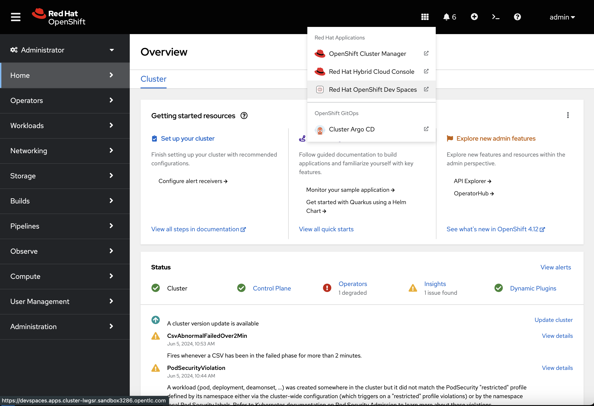
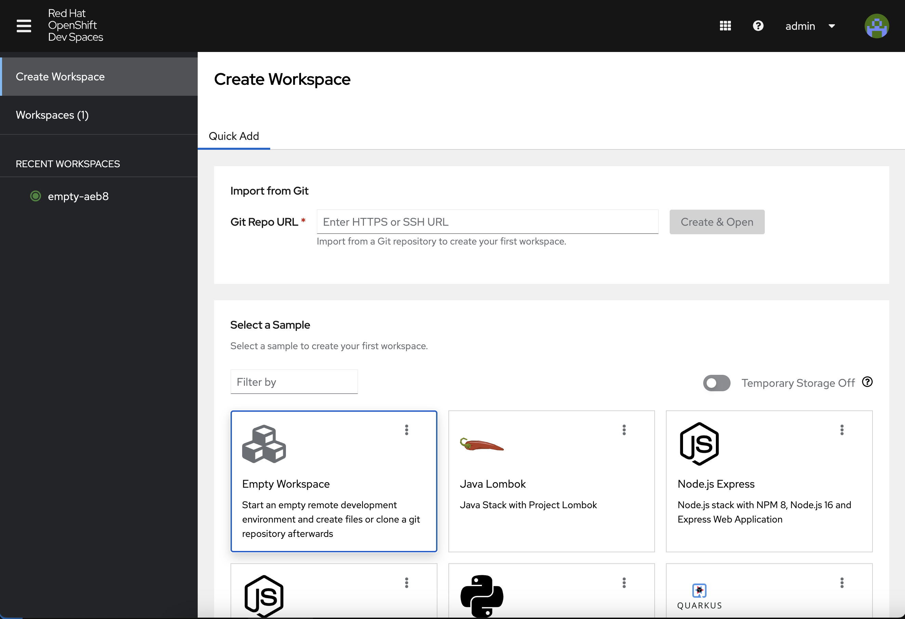
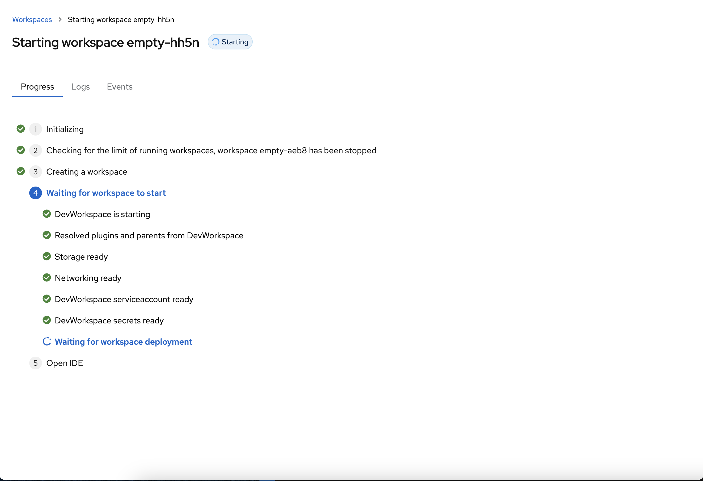
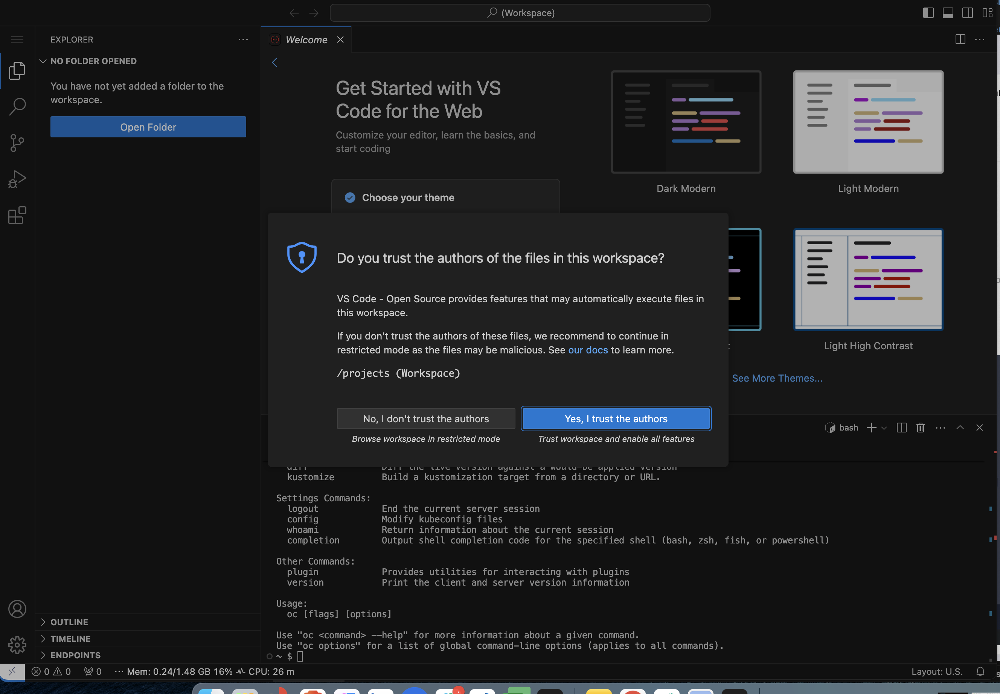
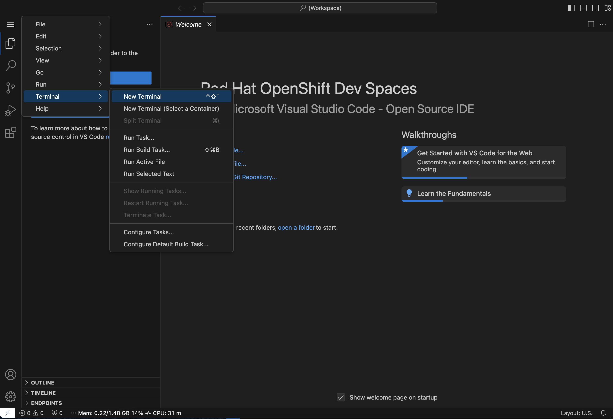

# Containers and OpenShift Workshop

Welcome to this workshop on containers and OpenShift! Today, we will use a hosted OCP environment provided by your instructor, along with these instructions, as we journey from simple Linux containers to advanced container orchestration using Red Hat OpenShift.

Let's begin by logging into the environment provided by your instructors and going to OpenShift Dev Spaces.

|NOTE:|
|----|
|You might see the following warning notification due to using an untrusted security certificate.

If you do get the warning, click the **Advanced** button to complete the process necessary to grant permission to the browser to access the OpenShift Web Console.|

Now click the menu button in the OpenShift console header and select **OpenShift Dev Spaces**

From here, create a new blank workspace and open the terminal

This will take a minute or two to load since this is the first time you are opening this workspace

Once your workspace loads, choose *Trust the Authors*

And finally, open the terminal by clicking the hamburger menu icon on the top left

Now, you are ready to begin the first workshop module. Continue with [Container Fundamentals](/container-fundamentals.md) now.
